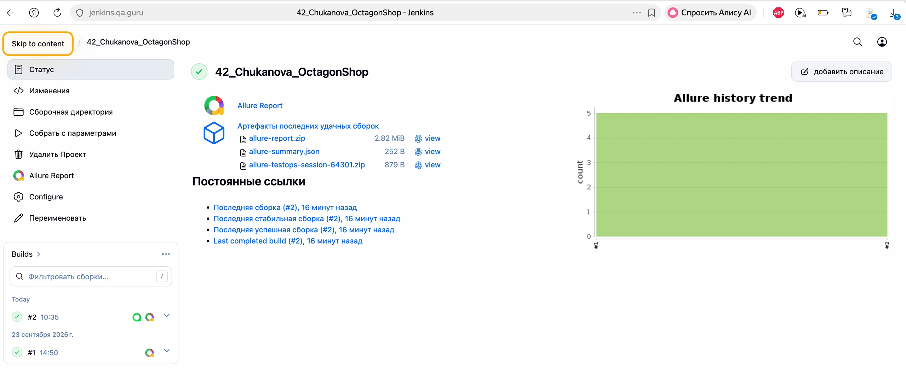
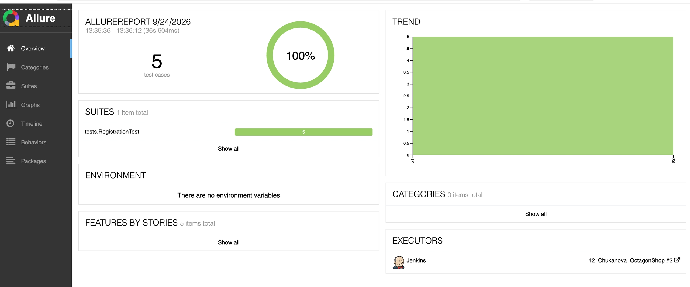
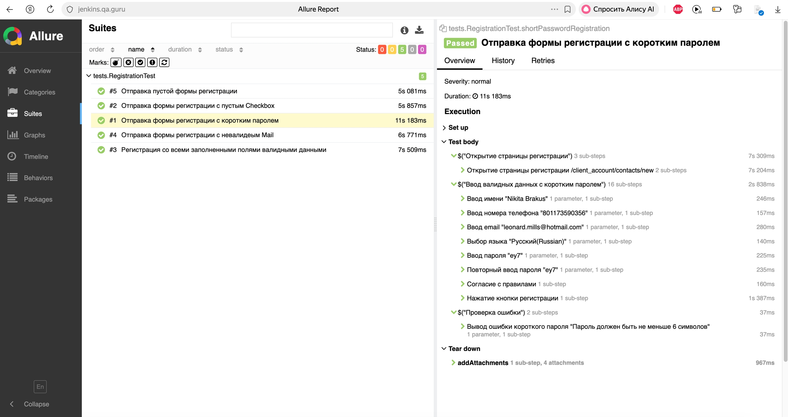
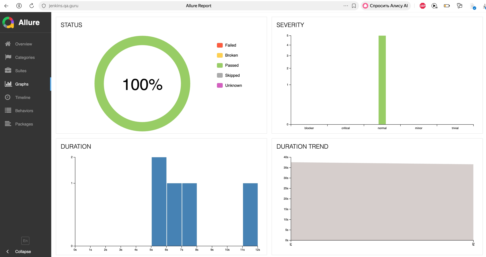
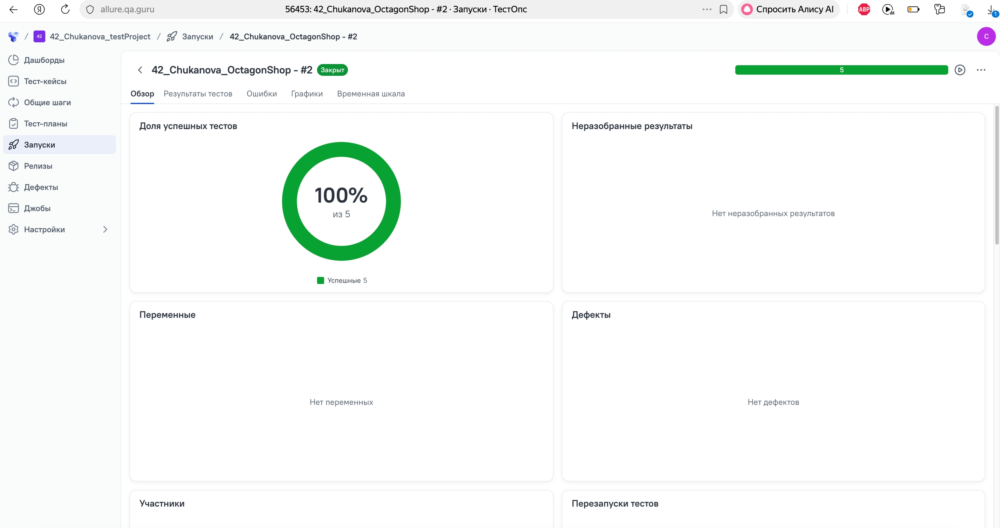
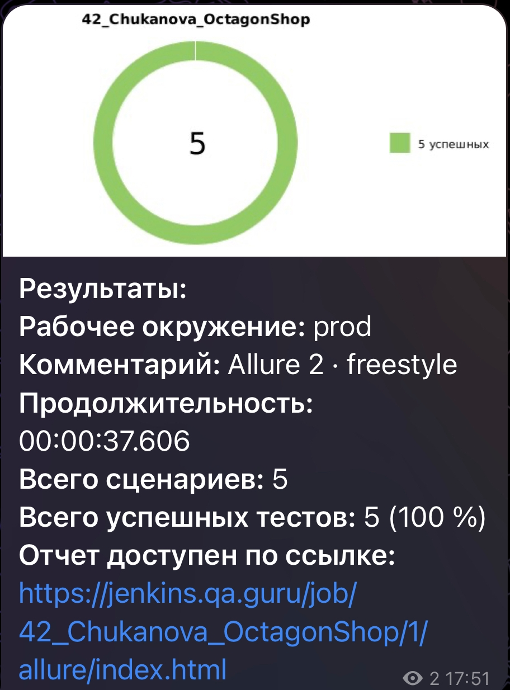

# Демо-проект по автоматизации тестирования для интернет магазина [Octagon shop](https://octagon-shop.com/)

<p align="center">  
<a href="https://octagon-shop.com//"></a>  
</p>

## **Содержание:**

* <a href="#tools">Технологии и инструменты</a>

* <a href="#cases">Примеры автоматизированных тест-кейсов</a>

* <a href="#jenkins">Сборка в Jenkins</a>

* <a href="#console">Запуск из терминала</a>

* <a href="#allure">Пример Allure отчета</a>

* <a href="#allure-testops">Интеграция с Allure TestOps</a>

* <a href="#telegram">Уведомление в Telegram при помощи бота</a>

* <a href="#video">Примеры видео выполнения тестов на Selenoid</a>
____

<a id="tools"></a>
## <a name="Технологии и инструменты">Технологии и инструменты:</a>

<p align="center">  
<a href="https://www.jetbrains.com/idea/"></a>  
<a href="https://www.java.com/"></a>  
<a href="https://github.com/"></a>  
<a href="https://junit.org/junit5/"></a>  
<a href="https://gradle.org/"></a>  
<a href="https://selenide.org/"></a>  
<a href="https://aerokube.com/selenoid/"></a>  
<a href="ht[images](images)tps://github.com/allure-framework/allure2"></a> 
<a href="https://qameta.io/"></a>   
<a href="https://www.jenkins.io/"></a>  
<a href="https://www.atlassian.com/ru/software/jira/"></a>  
</p>

- Тесты: IntelliJ IDEA + JUnit5 + Selenide, язык Java
- Сборка: Gradle
- Среда: Selenoid
- Удаленный запуск: Jenkins
- Отчеты: Allure-отчет и отправка результата в Telegram
---

<a id="cases"></a>
## <a name="Примеры автоматизированных тест-кейсов">Примеры автоматизированных тест-кейсов:</a>

- ✓ *Регистрастрация клиента со всеми заполненными полями*
- ✓ *Отправка пустой формы регистрации*
- ✓ *Отправка формы регистрации c пустым Checkbox*
- ✓ *Отправка формы регистрации с коротким паролем*
- ✓ *Отправка формы регистрации с невалидеым Mail*


____
<a id="jenkins"></a>
## </a><a name="Сборка"></a>Сборка в [Jenkins](https://jenkins.qa.guru/job/42_Chukanova_OctagonShop/)</a>

<p align="center">  
<a href="https://jenkins.qa.guru/job/42_Chukanova_OctagonShop/"></a>  
</p>


### **Параметры сборки в Jenkins:**

- *browser (браузер, по умолчанию chrome)*
- *browserVersion*
- *browserSize (размер окна браузера, по умолчанию 1920x1080)*
- *baseUrl (адрес тестируемого веб-сайта)*
- *remoteUrl (логин, пароль и адрес удаленного сервера Selenoid)*

<a id="console"></a>
## Команды для запуска из терминала

***Локальный запуск:***
```bash  
gradle clean
```

***Удалённый запуск через Jenkins:***
```bash  
clean
test
--continue
-Dbrowser=$BROWSER
-DremoteUrl=$REMOTEURL
-DbaseUrl=$BASEURL
-DbrowserVersion=$BROWSER_VERSION
-Dheadless=$HEADLESS
-DbrowserSize=$BROWSER_SIZE
```
___
<a id="allure"></a>
## </a> <a name="Allure"></a>Allure [отчет](https://jenkins.qa.guru/job/42_Chukanova_OctagonShop/allure/)</a>


### *Основная страница отчёта*

<p align="center">  
  
</p>  

### *Тест-кейсы*

<p align="center">  
  
</p>

### *Графики*

<p align="center">  
  
</p>

##  Интеграция с Allure TestOps

Выполнена интеграция сборки <code>Jenkins</code> с <code>Allure TestOps</code>.
Результат выполнения автотестов отображается в <code>Allure TestOps</code>

<p align="center">

</p>


##  Уведомления в Telegram с использованием бота

После завершения сборки, бот созданный в <code>Telegram</code>, автоматически обрабатывает и отправляет сообщение с результатом.

<p align="center">

</p>

## Видео примера запуска тестов в Selenoid

К каждому тесту в отчете прилагается видео прогона.
<p align="center">
   
</p>
